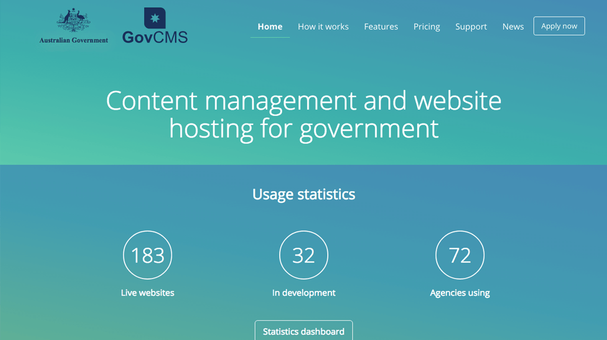
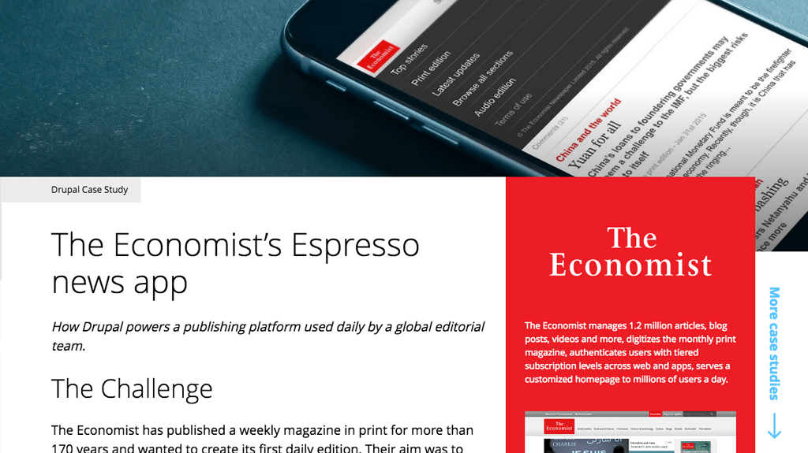
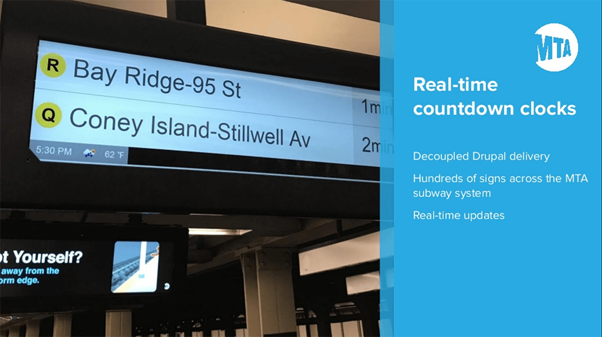
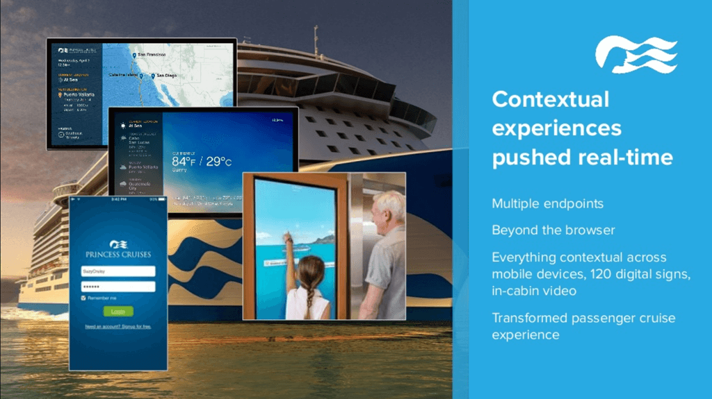

# DRUPAL 

Presented by
Academic Applications Support

---

## PRESENTATION OVERVIEW

- What is Drupal?
- Demo 1 : Shepherd / Webform
- Demo 2 : API building
- UofA Drupal Development
- Questions?

---

## WHAT IS DRUPAL?

---

"Drupal is a completely flexible system for building digital solutions.

It provides many layers that can be leveraged - from providing high level turn key solutions to low level code libraries and storage backend management."

---

It is used by governments for managing hundreds of sites.

---

It is used to power some of the most popular mobile applications in the world.

---

It drives digital signage across the New York subway system.

---

It is used to drive the complete experience across multiple channels for cruise liner passenger experience management.

---

### DRUPAL SYSTEM LAYERS

- Profile (e.g. WCMS, CCSP, contenta, Drupal Commerce)
- Features (e.g. blog, online shop, events)
- Modules (e.g. Trim, Keycloak, Views, SOLR Integration etc.)
- Administration UI and separated look and feel
- Services (e.g. routing, permissions, file handling etc.)
- Entities (e.g. users, articles, fields, media etc.)
- Configuration management (e.g. field types, displays, settings etc.)
- Framework classes, default storage management
- Custom classes, custom storage management

---

<!-- .slide: data-background="images/escher.jpg" -->
## DEMO 1 : SHEPHERD / WEBFORM

---

<!-- .slide: data-background="images/cables.jpg" -->
## DEMO 2 : API BUILDING

---

## UOFA DRUPAL DEVELOPMENT

- Reusable functionality
- Development process
- Life cycle

---

### REUSABLE FUNCTIONALITY

- Integration (PS reporting, PS milestone, Trim, email)
- Auth (CAS, Keycloak, LDAP)
- Form management (drafts, workflow, field access, PDF, controlled fields, reporting etc.)
- Content management (widgets, roles, workflow)
- Deployment (deploy, backup, restore, multiple environments)
- Look and feel (Style guide theme)

---

### DEVELOPMENT PROCESS

- Maturity:
  - Version control and process
  - Best practice adherence
  - Code quality analysis and code review
  - Automated testing
  - Continuous integration
  - Managed deployment
  - Tooling

---

### LIFE CYCLE

---

## THANK YOU.
## DISCUSSION / QUESTIONS?
