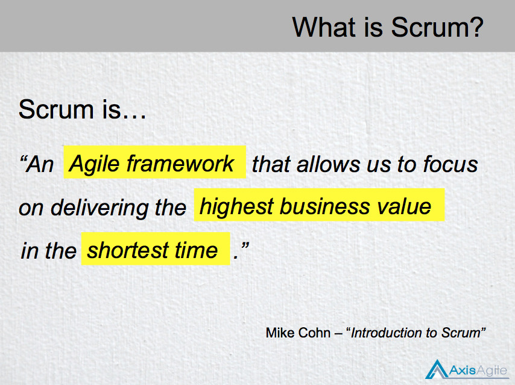

# Agile Community of Excellence

## Product Ownership
### (heavily opinionated)

Michael Welford

<michael.welford@adelaide.edu.au>

---

## Outline

- About Me
- Scrum: Product Owner
- UofA: Roles
- The conflict!
- Interlude: Product Manager
- Resolution
- Discussion / Questions

---

## About Me: Before UofA

- Previously a business owner for roughly 10 years in the digital agency space
- Delivered a lot of products, digital and otherwise over that time, with varying roles for me
- Always in a lean fashion (delivering prototypes early, MVP, into the market ASAP and interate)

---

## About Me: At UofA

- Senior Drupal Developer
- Been on three Scrum Projects with a number of releases
- Developer role on all projects

---

## Scrum: Product Owner

So let's take an overview of how Scrum sees the Product Owner role (thanks AxisAgile for you slides!)

---

---

---

## Questions?

---

## Thank you!

Michael Welford

<michael.welford@adelaide.edu.au>
