# Agile Community of Excellence

## Product Ownership

Michael Welford

<michael.welford@adelaide.edu.au>

---

## Outline

- About Me
- What is this?
- Scrum: Product Owner
- UofA: PO Candidates
- Some Thoughts (of Mine)
- Interlude: Product Management
- What to do?
- Discussion / Questions

---

<!-- .slide: data-background="images/megadeth.jpg" -->
## About Me

---

## About Me: Pre UofA

- Previously a business owner for roughly 10 years in the digital design agency space, working with small teams
- Delivered a lot of products, digital and otherwise over that time, where I played varying roles
- Predominantly deliverd in a lean fashion - wireframes and prototypes, MVP, into the market ASAP and interate
- Varying budgets (small / medium) / timelines (months / years)

---

## About Me: At UofA

- Senior Drupal Developer
- Been on three Scrum Projects
- Developer role on all projects
- I like to ask questions (since birth, much to my mother's chagrin)

---

## What is this?

- What is the accepted definition of a product owner?
- What do we have at the UofA?
- What are some of the associated challenges?
- What are others doing?
- What are some suggestions for how we might better fill the product owner role?

i.e. This is mainly a rant.

---

<!-- .slide: data-background="images/rugby-scrum.jpg" -->
## Scrum: Product Owner

---

## Scrum: Product Owner
### A brief overview
(thanks AxisAgile for your slides)

---

---

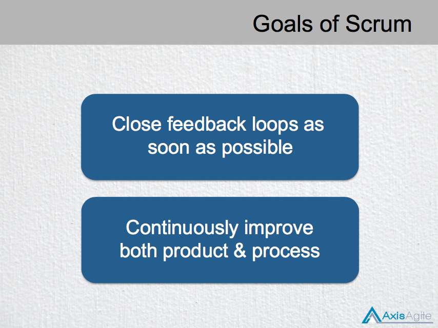

---

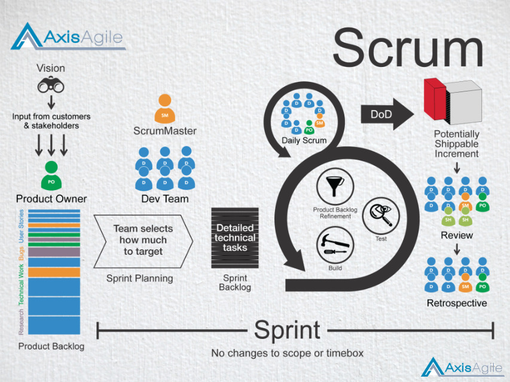

---

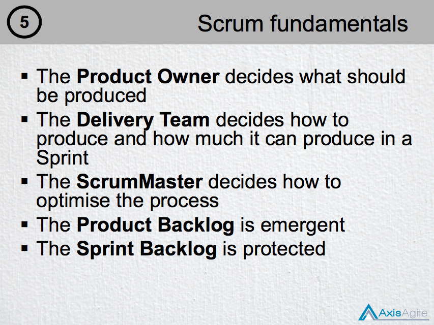

---

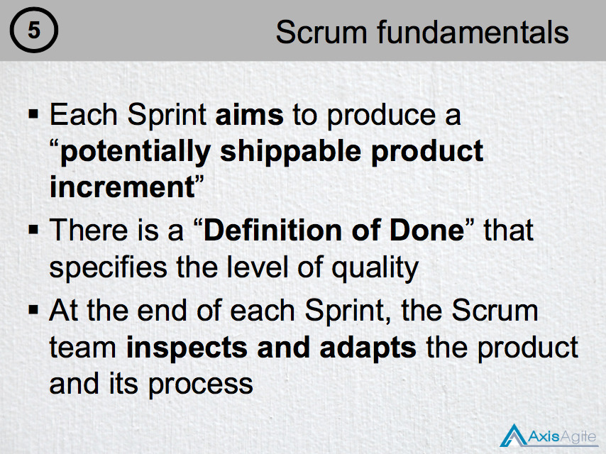

---

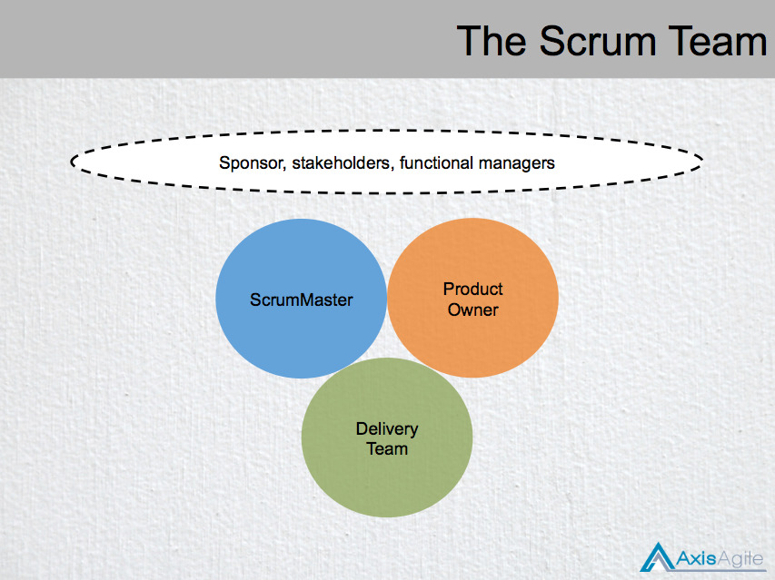

---

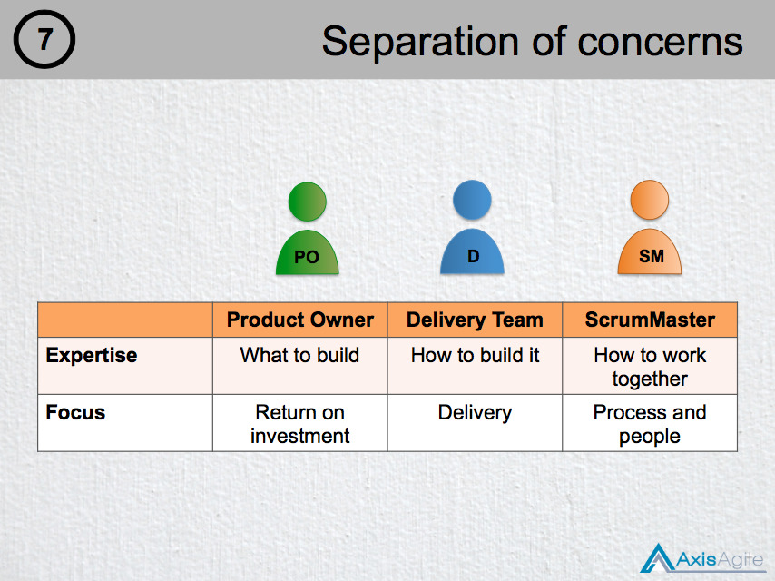

---

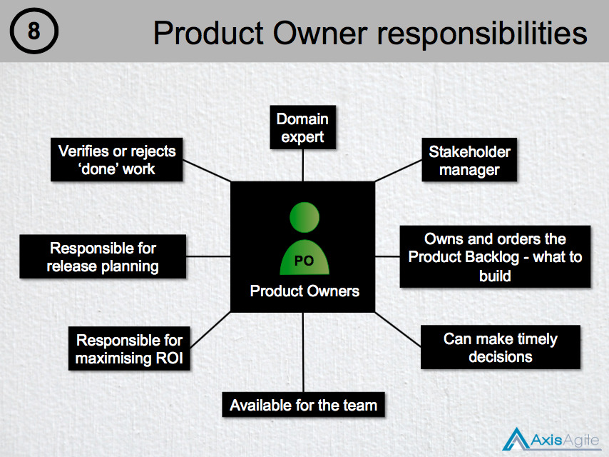

---

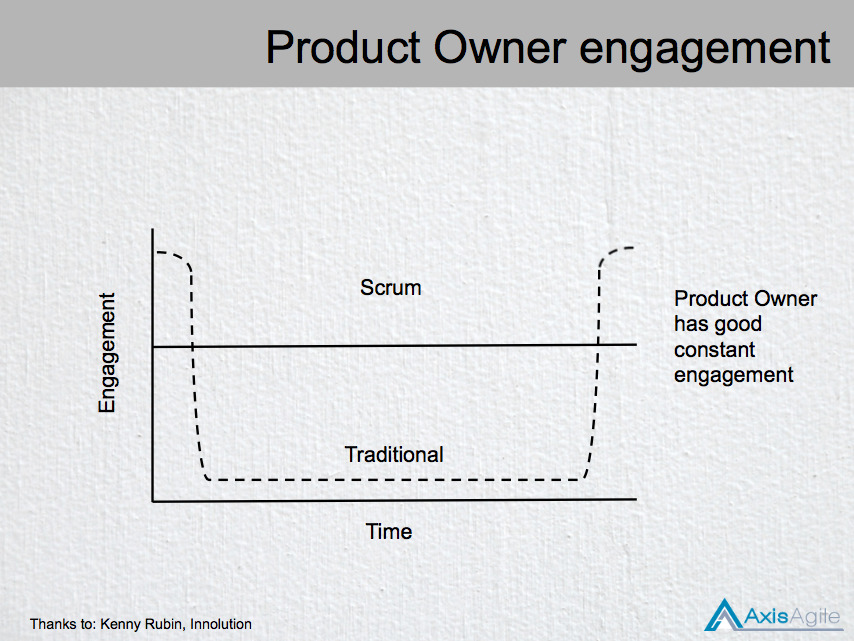

---

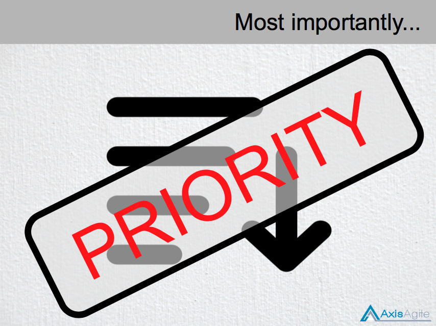

---

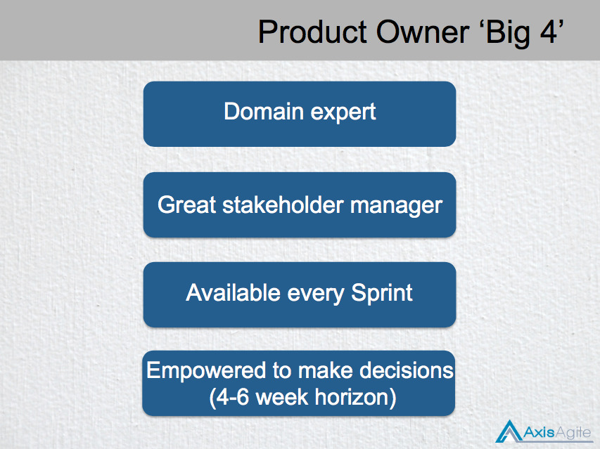

---

<!-- .slide: data-background="images/warning.jpg" -->
## Warning: Opinions Ahead!

---

## UofA: PO Candidates

At the UofA individuals in many roles that have been trained in Agile could do the product owner role with the most obvious candidates, with respect to skill sets, being Business Analysts, Project Managers or Business Owners / Representatives. Each with a number of different challenges.

---

## UofA: PO Candidates
### 1. Business Owner / Representative

#### Challenges
- Availability - they are running the business
- Product delivery experience?
- Agile / Scrum experience?
- Maximising ROI outside of their space

---

## UofA: PO Candidates
### 2. Project Manager

#### Challenges
- Domain expertise
- More than one project / availability
- Keeping the wheels on the car / BAU duties

---

## UofA: PO Candidates
### 3. Business Analyst

#### Challenges
- Authority
- Domain expertise
- Product release experience
- Wider stakeholder engagement
- Focus on ROI

---

## Some Thoughts (of Mine)

- Maximising ROI should not just be for the immediate stakeholder, but for the greater UofA if possible, at least considered
- Product owners should be experienced in product delivery
- Product owners should have the ability to scrap a product or split it into multiple products
- Product owners should be a measuring a product's success (after each interation) independently of the business
- Product owners should have access to everyone who could make a product better e.g. business, staff, *all* users of a product, marketing, architects etc.
- We can't have multiple people doing the product owner role, it's not effective, we need clear lines of responsibility

Who should be the product owner?

---

<!-- .slide: data-background="images/interlude.jpg" -->

---

## Interlude: Product Management

"Product management is the intersection between business, technology and user experience... experience in one, passionate about all three, conversant in all"
(http://www.mindtheproduct.com/2011/10/what-exactly-is-a-product-manager/)

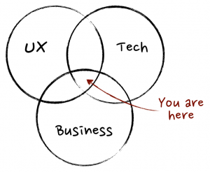

---

## Interlude: Product Management

For a great comparison between the roles of product owner and product manager
(https://www.scrumalliance.org/community/articles/2014/february/mapping-of-the-product-manager-role-to-product-own)

In many organisations it is the product manager who assumes the product owner role. e.g.
(https://en.wikipedia.org/wiki/Product_manager)
(http://www.mindtheproduct.com/2011/10/what-exactly-is-a-product-manager/)
(https://techbeacon.com/how-agile-distinguishes-between-product-managers-product-owners)

Does the UofA need product managers?

---

<!-- .slide: data-background="images/escher.jpg" -->
## What to do?

---

## What to do?
### My suggestions

I feel like we are expecting people to be product owners but *still* do their normal day to day. I think they need to be product owners first if they are going to do it at all - it's a big job.

Let's develop / hire some product managers (Business or TS or both). I think we need them irrespective of whether we are doing Scrum or not.

---

## What to do?
### My suggestions

In the mean time PMs are IMHO the most suitable to jump into the role in the following way: 
- Reduce work load to 1 or 2 projects (2 if small)
- The PO role comes first before BAU PM duties (maybe could have a managing PM to handle BAU)
- BAs would provide assistance to the business owners / stakeholders and business SMEs
- Push for an initial pre-project period (2-4 weeks) where PM gets up to speed on the domain problem and does some persona work, journey mapping, ideation, workshops etc.

---

## Thank you!

---

## Discussion / Questions?

---

## Thank you!

Michael Welford

<michael.welford@adelaide.edu.au>
